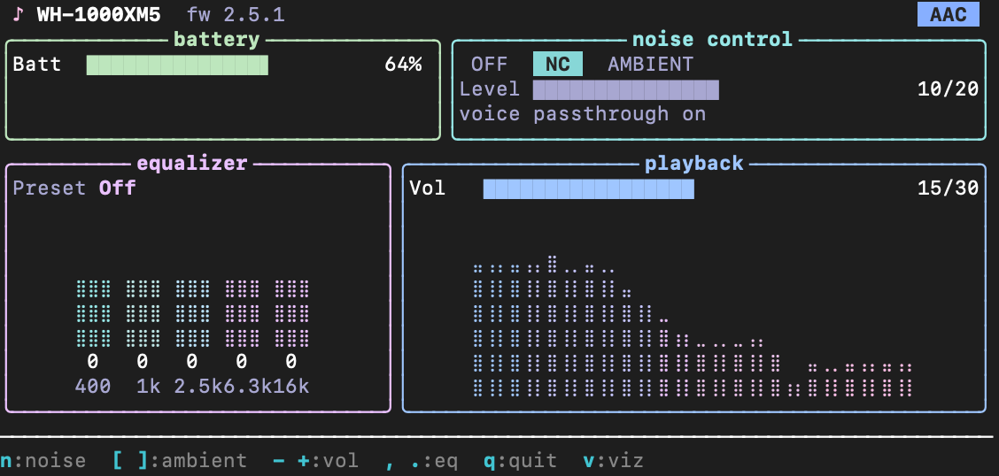
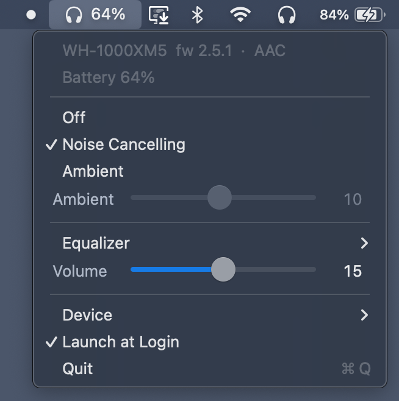

# sonytuibar

[](LICENSE)


A btop-style terminal client and a native macOS menu bar app for Sony WH-1000XM5 headphones.



A modified version of [Plutoberth's original SonyHeadphonesClient](https://github.com/Plutoberth/SonyHeadphonesClient)
and [mos9527 & Amr Satrio's SonyHeadphonesClient rewrite](https://github.com/mos9527/SonyHeadphonesClient) —
made for my specific needs and platforms.

I'll keep updating it as I work on it, but it's been working well for me, so I'll probably
leave it as-is for a while.

## Compatibility

- macOS — terminal (TUI)
- macOS — menu bar app



---

> Everything below this line is maintainer/developer notes.

## Install & use (macOS)

Configure once:

```sh
cmake -S . -B build-release -DCMAKE_BUILD_TYPE=Release -DMDR_ENABLE_CODEGEN=OFF -DMDR_BUILD_CLIENT=OFF
```

Then build + install whichever clients you want. The install script takes a
mode: `both` (default), `tui`, or `bar`.

**Both:**

```sh
cmake --build build-release --target SonyHeadphonesClientTUI SonyHeadphonesMenuBar
./scripts/install-macos.sh
```

**TUI only** — `sonytui` on your `PATH` + **Sony Headphones TUI.app** (launches the TUI in Terminal):

```sh
cmake --build build-release --target SonyHeadphonesClientTUI
./scripts/install-macos.sh tui
```

**Menu bar app only** — **Sony Headphones Bar.app** in `~/Applications`:

```sh
cmake --build build-release --target SonyHeadphonesMenuBar
./scripts/install-macos.sh bar
```

(The CLI goes to `/usr/local/bin`, so the TUI install may prompt for `sudo`; the
menu bar install is per-user, no `sudo`.)

Keybinds and per-client behavior live in the sub-READMEs:
[`client-tui/README.md`](client-tui/README.md) and [`client-menubar/README.md`](client-menubar/README.md).

## What's in here

- `client-tui/` — the FTXUI terminal client (`sonytui`) + the CoreAudio system-audio visualizer.
- `client-menubar/` — the native NSMenu menu bar app (`Sony Headphones Bar`).
- `libmdr/`, `client/` — upstream's MDR protocol engine and reference ImGui/SDL client.

## Quirks & notes

- **EQ presets** on the XM5 are limited to the working set (Off + the firmware presets that
  actually apply); some bands the protocol exposes don't take effect on this model.
- **No power-off over MDR** — the XM5 firmware ignores it, so there's no power control.
- **Never poll battery.** The clients rely on the headphones' push notifications; actively
  polling battery desyncs the protocol sequence numbers and wedges the link.
- **Visualizer permissions:** the visualizer captures system audio, so it needs *System Audio
  Recording* permission. Terminal.app declares the usage string and prompts for it; some
  terminals (Ghostty, WezTerm) don't, so it silently does nothing until you grant the terminal
  that permission manually in **Privacy & Security → Screen & System Audio Recording**.
- **Menu bar signing:** `install-macos.sh` ad-hoc signs the installed menu bar bundle in
  `~/Applications` so Launch at Login and privacy permissions see a valid app signature. This is
  local signing, not Developer ID notarization.
- **One client at a time.** The headphones speak to a single MDR client — don't run the TUI and
  the menu bar app against them simultaneously.

## Credits

- [Plutoberth](https://github.com/Plutoberth/SonyHeadphonesClient) — the original SonyHeadphonesClient.
- [mos9527](https://github.com/mos9527) & [Amr Satrio (@Amrsatrio)](https://github.com/Amrsatrio) —
  the SonyHeadphonesClient rewrite, the `libmdr` engine, and the reference client this stands on.
- [FTXUI](https://github.com/ArthurSonzogni/FTXUI) (ArthurSonzogni) — the terminal UI library
  behind the TUI.

## License

MIT — see [`LICENSE`](LICENSE). Upstream copyright (mos9527, Amr Satrio) is retained; my additions
(`client-tui`, `client-menubar`) are released under the same license.
